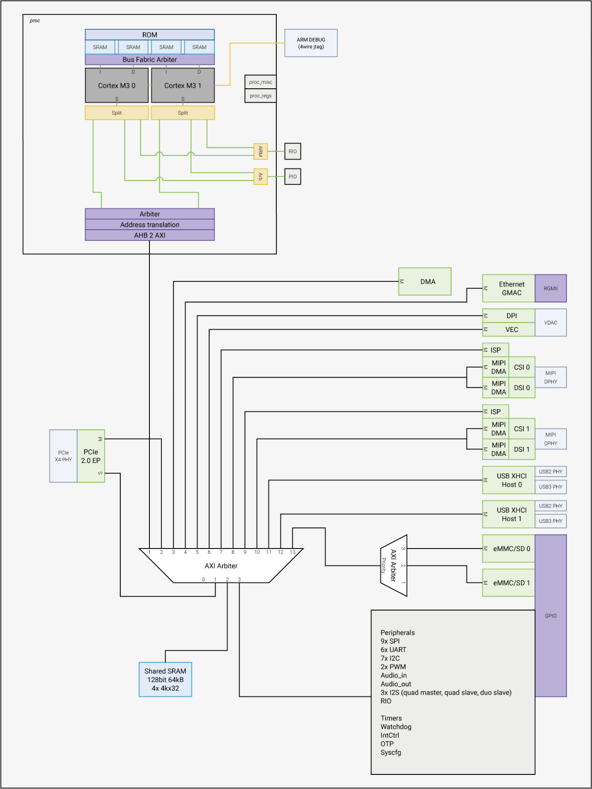
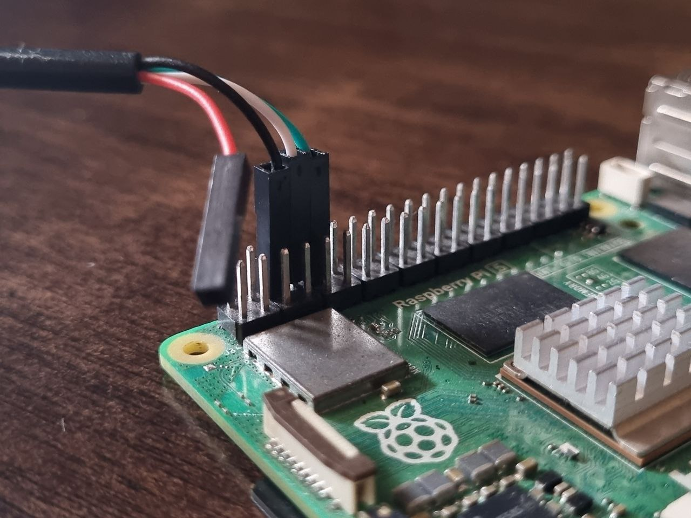

# rpi5os

rpi5os is a minimalistic kernel written for the Raspberry Pi 5. It is written in C and ARMv8 assembly. This was written mainly to summarize my understanding of the ARM architecture and the Raspberry Pi ecosystem, especially that of the Pi 5. This is not a full-fledged operating system, but a simple kernel that can be used to understand the basics of operating systems.

# Table of Contents

- [Features](#features)
- [The Raspberry Pi 5](#the-raspberry-pi-5)
- [The RP1 Southbridge](#the-rp1-southbridge)
- [The GPIO Header](#the-gpio-header)
- [Using the Kernel](#using-the-kernel)
  - [Pre-requisites](#pre-requisites)
  - [With prebuilt kernel image](#with-prebuilt-kernel-image)
  - [Building the kernel from source](#building-the-kernel-from-source)
  - [Using the UART interface to see messages spit out by the kernel](#using-the-uart-interface-to-see-messages-spit-out-by-the-kernel)
  - [Hardware Debugging](#hardware-debugging)
- [The MMU](#the-mmu)
- [Caveats and Notes](#caveats-and-notes)
- [Future Work](#future-work)

# Features

- Uses **ARM PrimeCell PL011** UART (revision r1p5) for serial communication, with a baud rate of **9600 bps**. ([docs](https://developer.arm.com/documentation/ddi0183/g))
- Uses the **ARM Corelink Generic Interrupt Controller (GIC) - 400** for handling interrupts. ([docs](https://developer.arm.com/documentation/ddi0471/b))
- Uses the **BCM2835 ARM System Timer** for scheduling and timer ticks in general. ([docs](https://datasheets.raspberrypi.com/bcm2835/bcm2835-peripherals.pdf))
- System Calls provided:
  - `sys_write` - Writes a string to the serial console.
  - `sys_fork` - Creates a new process, from the current process.
  - `sys_malloc` - Allocates a block of memory.
  - `sys_proc_exit` - Exits from the current process
- Comes with Virtual Memory enabled, for a physical addressable memory of 4GiB, along with the peripheral space.

# The Raspberry Pi 5

- 64-bit quad-core ARM Cortex-A76 CPU @ 2.4GHz.
- BCM2712 SoC; 16nm.
- 4GiB LPDDR4X-4267 SDRAM.
- RP1 southbridge.

# The RP1 Southbridge

The RP1 peripheral controller, a dual core ARM Cortex-M3 microcontroller, is the southbridge for the Raspberry Pi 5, connected to the BCM2712 AP via an x4 PCIe 2.0 link. In the previous generations of the Pis, the southbrigde only controlled the Ethernet and downstream USB ports. Whereas, on the Pi5, the RP1 controls the following external interfaces:

- 2x USB 3.0 ports.
- 2x USB 2.0 ports.
- Gigabit Ethernet.
- 2x MIPI CSI-2 camera interfaces.
- 2x MIPI DSI display interfaces.
- 40-pin GPIO header, with 28 GPIOs (with alternate functions to support various low-speed peripherals).

Additional Features:

- 8-channel DMA controller.
- 3 integrated PLLs, with 2 fractional-N PLLs and 1 integer PLL.
- 5-input ADC
- 64kiB of shared SRAM accessible by both the AP and RP1.
- Timebase generator.

The RP1 microcontroller has a **32-bit** address space, which translates to a **40-bit** address space on the PCIe host bus. This mapping is clearly tabulated in the [RP1 Peripherals](https://datasheets.raspberrypi.com/rp1/rp1-peripherals.pdf) documentation.
The PCIe host bus is connected to the BCM2712 AP mapped to a start address of **0x1F00000000**.
Hence to access the RP1 peripherals address space from the BCM2712 AP address space, we will have to add the above mentioned offsets to the base address.

> NOTE: By default, the PCIe X4 interface is reset before loading the kernel so that the PCIe RC is in a clean state. For bare metal/bringup you can add `pciex4_reset=0` to `config.txt` because writing a bare metal PCIe RC driver probably isn't everyone's cup of tea.

# The GPIO Header

This [repo](https://github.com/Felipegalind0/RPI5.pinout) provides a detailed explanation of the GPIO header on the Raspberry Pi 5.

TLDR: The ARM PrimeCell Pl011 UART is on GPIO pins 14 and 15 of alternate function 4.
The corresponding header pin numbers are as follows:

PIN_2 - **+5V**\
PIN_4 - **+5V**\
PIN_6 - **GND**\
PIN_8 - **GPIO_14** (UART0_TX)\
PIN_10 - **GPIO_15** (UART0_RX)

The 5V supply isn't required if the Pi is powered via the USB-C port.

# Using the Kernel

## Pre-requisites

- A Raspberry Pi 5 Model B (ofc xD).
- A microSD card with a working image of Raspberry Pi OS(64-bit).
- A USB to TTL serial cable for connecting to the UART pins on the GPIO header. (install appropraite drivers if required)
- A terminal emulator like `minicom` or `screen` (macOS users can use the SerialTools application from the [App Store](https://apps.apple.com/gb/app/serialtools/id611021963)).
- A Raspberry Pi debug probe for hardware debugging. (optional)

## With prebuilt kernel image

- Download the prebuilt kernel image from the [releases](https://github.com/puranikvinit/rpi5os/releases) page.
- Extract the contents of the zip file downloaded.
- Copy the `kernel8.img` file to the boot partition of the SD card.

## Building the kernel from source

- Clone the repository from [here](https://github.com/puranikvinit/rpi5os.git).
- Run `make` to build the kernel image.
- Copy the `kernel8.img` file to the boot partition of the SD card.
- Make the changes to the `config.txt` file as mentioned in the `changes-to-config.txt` file present in the source.
- Insert the SD card into the Raspberry Pi 5 and power it on!

## Using the UART interface to see messages spit out by the kernel

- Connect the USB to TTL serial cable to the UART pins on the GPIO header, as shown in the image below

  

  - The color coding of the TTL serial cable wires in the image is as follows:
    - Red - **+5V power supply** (not required in our case, as mentioned above)
    - Black - **GND**
    - White - **RX** (Receive data from the Pi from the USB interface)
    - Green - **TX** (Transmit data to the Pi from the USB interface)

The RX and TX wires should be connected to UART0_TX and UART0_RX pins on the GPIO header respectively.

- Open the terminal emulator and connect to the serial port, while setting the options as follows:

  - Serial Port: `/dev/usbserial-110` (this is the device in my case, check the port where the USB to TTL cable is connected in your machine)
  - Baud rate: **9600**
  - Data bits: **8**
  - Stop bits: **1**
  - Parity: **None**
  - Flow control: **None**

- Power on the Raspberry Pi 5 and you should see the kernel messages being printed on the terminal emulator.

## Hardware Debugging

Hardware debugging on the Raspberry Pi 5 is only supported via the dedicated UART port (the one which is located in between the two HDMI ports).
The complete steps to setup the environment for hardware dubugging can be found in this [article](https://macoy.me/blog/programming/RaspberryPi5Debugging)

The required configuration files for OpenOCD and LLDB commands (yes I have used LLDB for debugging as GDB multiarch debugging isn't supported on macOS with Apple Silicon chips) can be found in the source itself.

Also, see the `changes-to-config.txt` for the required parameter to be set before booting the kernel.

# The MMU

- The MMU translation tables are setup with a **4KiB** page size, and the kernel uses a 2-level translation table for the same.
- The complete memory layout for all the mappings and all the corresponding assumptions made during the design of the translation table is neatly documented inline in the source code.
- The mapping layout is specifically designed for the **4GiB** addressable memory space of the Raspberry Pi 5. For other models, the mapping layout will have to be changed accordingly.

# Caveats and Notes

- The RP1 peripherals documentation linked above mentions the the frequency of `clk_uart` (which is an independent UART baud clock used by the PL011 UART, and is a direct derivative of the quartz crystal oscillator on the board), is **48MHz**, but on reading the respective register values on a working UART implementation and reverse engineering, it was found that the frequency is **50MHz**. This is the frequency used in the kernel for baud rate calculations.
- All the base addresses of the peripherals used by the kernel are obtained from the devicetree source of the BCM2712 SoC. There is no concrete documentation available for the AP at the time of writing this README.
- This code is not backwards compatible with the previous generations of the Raspberry Pi, because of the obvious variations in the SoC and the peripheral controllers.
- A wierd issue was observed when enabling interrupt in the EL0_64 SVC exception handler, which caused the PC (program counter) register to point to a misaligned and invalid memory address, hence, as of now, the interrupts are not enabled while servicing EL0_64 SVC exceptions. The cause of the issue is unknown, and will be fixed once more details will be known.

# Future Work

- [ ] Implement a logger for the kernel, to get detailed dumps of the processor and kernel state at important points in the code.
- [ ] Unpark the other cores of the BCM2712 AP, and have a working multi-core system.
- [ ] Implement a simple filesystem.
- [ ] Implement a simple shell for user interactions.
- [ ] Add support for Executable and Linkable Format (ELF) binaries.
- [ ] Implement Netowrking support with drivers for the RP1 Ethernet controller.
